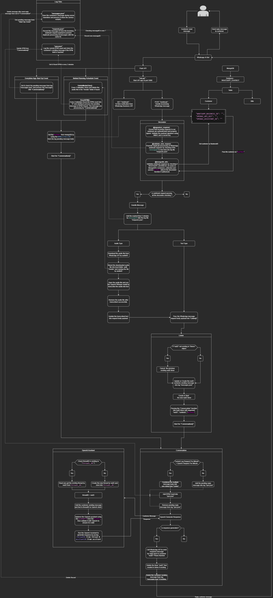

# Project Setup with Docker Compose

This project uses Docker Compose to set up a MongoDB database and a Flask API service. Follow the instructions below to get started.

## Flow Overview

Below is a visual representation of the application's logic flow:



This diagram illustrates the interaction between the MongoDB database and the Flask API, highlighting the key processes and data flow within the application.

## Prerequisites

- [Docker](https://www.docker.com/get-started) installed on your machine.
- [Docker Compose](https://docs.docker.com/compose/install/) installed.

## Setup Instructions

1. **Clone the Repository**

   Clone this repository to your local machine:

   ```bash
   git clone <repository-url>
   cd <repository-directory>
   ```

2. **Environment Variables**

   Ensure you have a `.env` file for MongoDB with the necessary environment variables. The file should be located at `./mongodb/mongodb.env` and contain:

   ```plaintext
   MONGO_INITDB_ROOT_USERNAME=your_username
   MONGO_INITDB_ROOT_PASSWORD=your_password
   ```

3. **Network Configuration**

   Ensure that the `whatsappchatbot` network is created externally if it doesn't exist:

   ```bash
   docker network create whatsappchatbot
   ```

4. **Build and Run Services**

   Use Docker Compose to build and run the services:

   ```bash
   docker-compose up -d --build
   ```

   This command will start the MongoDB and Flask API services. The MongoDB service will be available on port `27017`, and the Flask API will be available on port `5000`.

5. **Accessing the Services**

   - **MongoDB**: Connect to MongoDB at `localhost:27017`.
   - **Flask API**: Access the API at `http://localhost:5000`.

6. **Stopping the Services**

   To stop the services, run:

   ```bash
   docker-compose down
   ```

## Directory Structure

- `mongodb/`: Contains MongoDB-related files, including the `mongodb.env` file for environment variables.
- `flaskapi/`: Contains the Flask application code and Dockerfile.

## Notes

- The `mongodb_data` directory is used to persist MongoDB data. It is included in the `.gitignore` file to prevent data from being tracked in the repository.
- Ensure that the `Dockerfile` for the Flask API is correctly set up in the root directory.

## Troubleshooting

- If you encounter issues with network connectivity, ensure the `whatsappchatbot` network is correctly set up.
- Verify that the environment variables in `mongodb.env` are correct and accessible.

Feel free to modify this README to better fit your project's specific needs.
